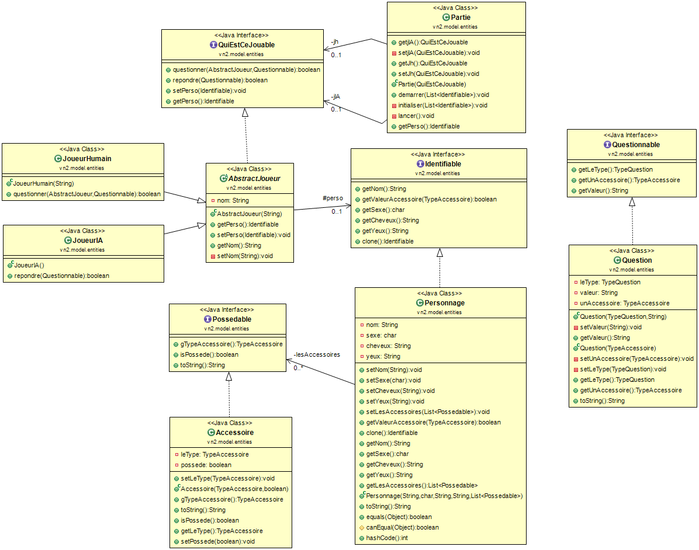
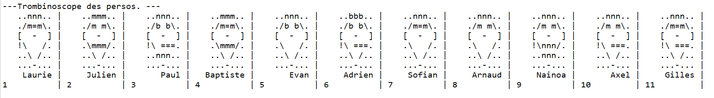
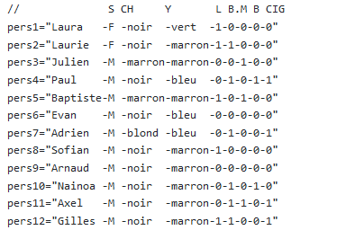

# Jeu du Qui est-ce?
 jeu du "Qui est-ce?" en java, tout en mode console mais avec le dessin des têtes.
 
 ## I) DCLA
 
 
 ## II) CODE SCE
  cfs JAVE_SCE_QUI_EST_CE.ZIP
  
 ## III) Exécutable avec .bat
  cfs lanceurduJeu.ZIP
  
 ## IV) les dessins:
 En mode ascii bien sûr.
 
 

## V) les données utilisées(fichier .properties)

 

###les carcatéristiques de bases:
 
 * S : pour SEXE
 * CH: pour CHEVEUX
 * Y : pour YEUX

###considérés comme accessoires:
 * L:   pour LUNETTE
 * B.:  pour BARBE
 * M:   pour MOUSTACHE
 * B:   pour BOUCLE OREILLE
 * CIG: pour CIGARE

Des tests sont à poursuivre, il reste quelques cas qui ne fonctionnent pas !

